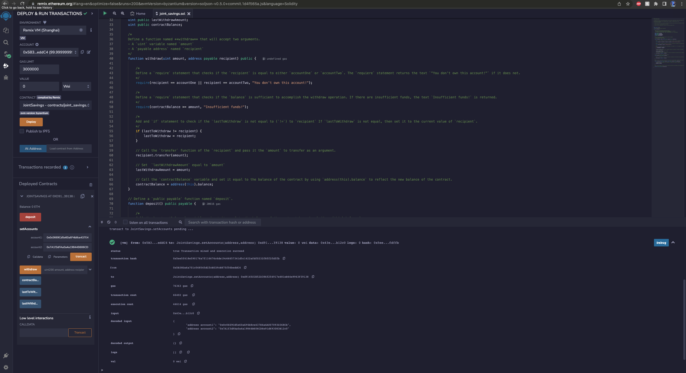
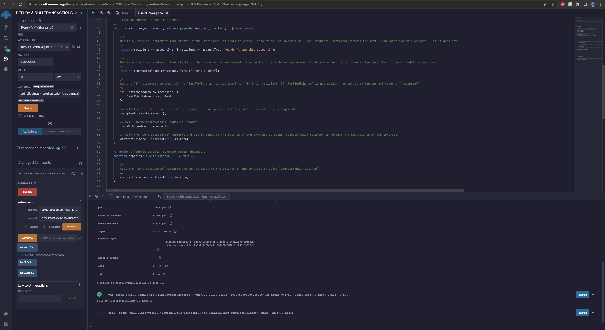
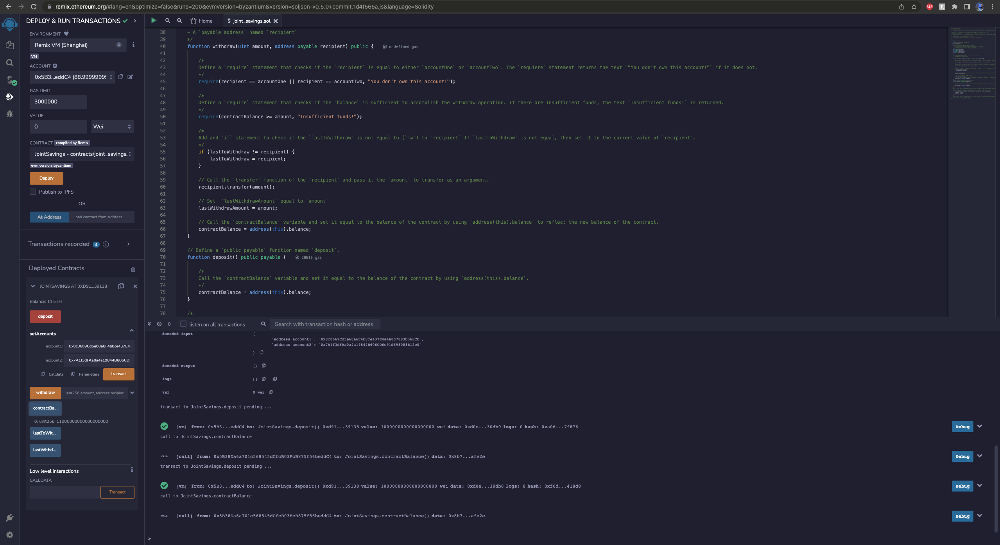
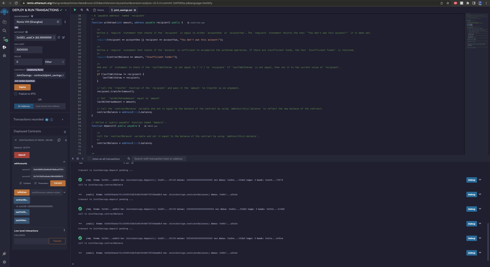
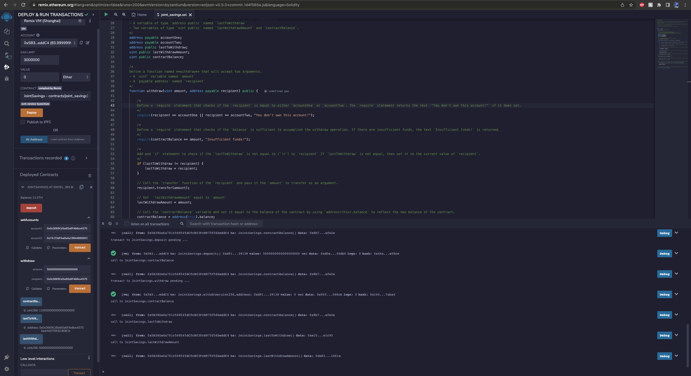
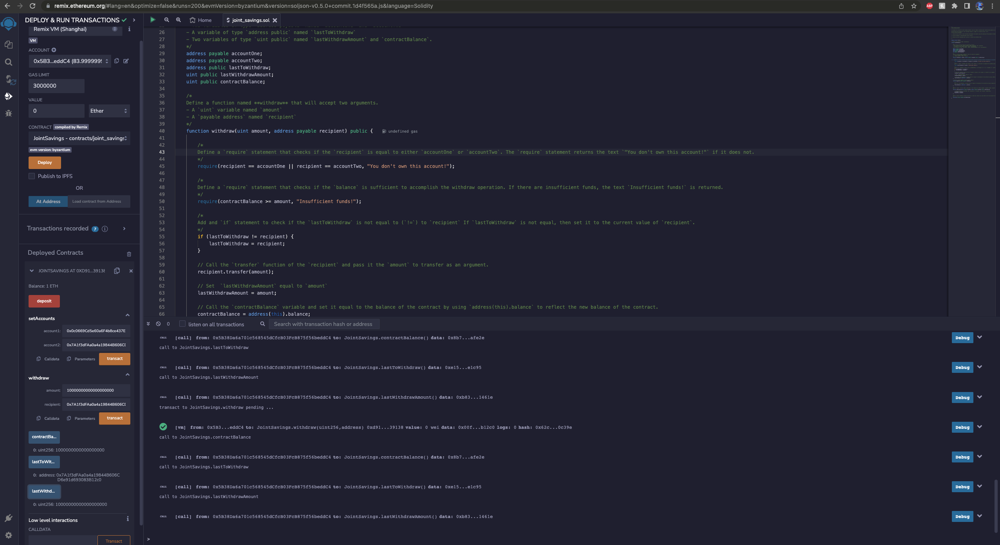

# Module 20: Joint Savings Account

In this project, we're creating a smart contract for a joint savings account that can be controlled by 2 joint account owners. The account can deposit and withdraw funds.

## Results:
Setup the accounts using `setAccounts`:

Send 1 Ether in Wei:

Send 10 Ether in Wei:

Send 5 Ether:

Withdraw 5 Ether and send to accountOne:

Withdraw 10 Ether and send to accountTwo:
